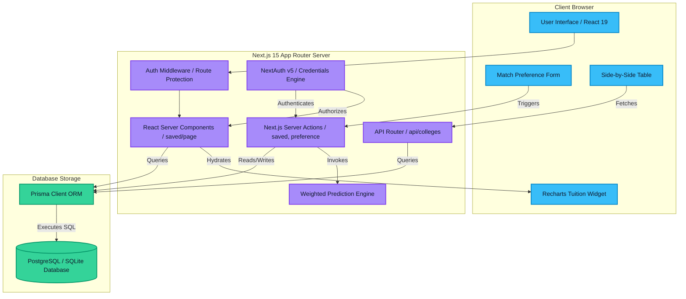

# CampusCompass – System Architecture Documentation

This document describes the software architecture, design patterns, and data flows implemented in **CampusCompass**.

---

## 1. System Architecture Overview

CampusCompass is built on the **Next.js 15 App Router** using **React 19 (Server/Client Components)** and **TypeScript**. The application is designed to be fully self-contained, using **Prisma ORM** with a primary **PostgreSQL** datasource for production and a local **SQLite** datasource for development.

---

## 2. Key Architectural Decisions

### 2.1 Next.js 15 App Router & React Server Components (RSC)
*   **Decoupled Rendering**: We use RSCs (e.g. `/colleges/page.tsx`, `/saved/page.tsx`) by default to query the database directly on the server. This reduces client-side JS bundle sizes and improves Initial Page Load and SEO.
*   **Selective Client-Side Hydration**: Client components are used exclusively for interactive elements (e.g. forms, dropdowns, sitemaps) and visualization widgets (e.g., Recharts widgets).

### 2.2 Server Actions for Core Data Mutators
*   **Security & Execution**: Data changes (bookmarks, preference updates, shortlist shifts) are performed via Next.js Server Actions (e.g. `src/app/actions/saved.ts`).
*   **Optimistic Updates & Cache Validation**: We use `revalidatePath` to trigger instant view cache updates upon action completion. This updates the dashboard metrics without full-page reloads.

### 2.3 NextAuth v5 (Beta) Security Core
*   **Edge-Compatible Middleware**: The route protection is handled by NextAuth in `src/middleware.ts` which utilizes `auth.config.ts` (Edge-compatible runtime setup) to inspect sessions before rendering dashboard routes.
*   **Session Database Store**: Sessions and credentials credentials are validated using bcrypt and queried through the Prisma Database Adapter.

### 2.4 DB Portability Layer (Prisma ORM)
*   **Type Safety**: The codebase relies on generated types from `@prisma/client`.
*   **Abstracted Schema Design**: Enums and database types are aligned so that the exact same application code runs on both PostgreSQL and SQLite clients without code modification.
