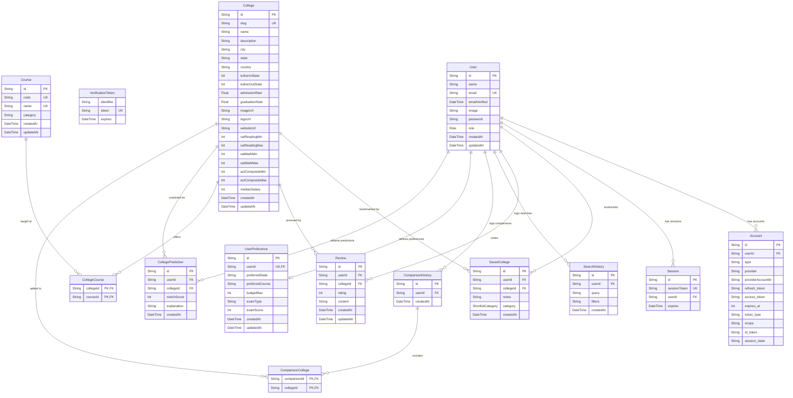

# CampusCompass – Database Entity Relationship Diagram (ERD)

This document contains the complete database entity-relationship diagram and detailed model specification for the CampusCompass platform.

---

## 1. Entity-Relationship Diagram (ERD)

The diagram below details the 13 tables, their attributes, keys, and relational cardinatlites.

---

## 2. Table Specifications

### 2.1 User
*   **Role**: Stores student/admin profile details.
*   **Attributes**:
    *   `id` (String, Primary Key): Unique identifier (CUID format).
    *   `email` (String, Unique Key): Login credential.
    *   `password` (String, Optional): Encrypted password for Credentials Provider.
    *   `role` (Enum: `USER`, `ADMIN`): System authorization level.

### 2.2 SavedCollege
*   **Role**: Junction table representing bookmarks.
*   **Attributes**:
    *   `id` (String, Primary Key): Unique identifier.
    *   `userId` (String, Foreign Key -> User.id): Owning student.
    *   `collegeId` (String, Foreign Key -> College.id): Bookmarked college.
    *   `category` (Enum: `DREAM`, `TARGET`, `SAFE`): Shortlist segment.
    *   `notes` (String, Optional): Custom student checklist.
*   **Unique Index**: `[userId, collegeId]` (a user can save a college only once).

### 2.3 UserPreference
*   **Role**: Stores student criteria for match predictor algorithms.
*   **Attributes**:
    *   `userId` (String, Unique Key, Foreign Key -> User.id): Owning student (1-to-1).
    *   `preferredState` (String, Optional): 2-letter state code.
    *   `preferredCourse` (String, Optional): Category name (e.g. "Computer Science").
    *   `budgetMax` (Int, Optional): Annual budget ceiling.
    *   `examType` (String, Optional): "SAT" or "ACT".
    *   `examScore` (Int, Optional): Standardized exam score.

### 2.4 ComparisonHistory & ComparisonCollege
*   **Role**: Tracks historical comparison queries to populate dashboard.
*   **ComparisonCollege (Junction Table)**:
    *   `comparisonId` (String, PK, FK -> ComparisonHistory.id): Parent log.
    *   `collegeId` (String, PK, FK -> College.id): Referenced college.

---

## 3. Indexing & Optimization Strategy

To maintain sub-5ms query times under high loads, indexing is configured on all foreign keys and commonly filtered columns:
1.  **SavedCollege**: Unique composite index on `[userId, collegeId]` prevents duplicate bookmarks.
2.  **College**: Indexes on `state`, `tuitionOutState`, and `admissionRate` optimize catalog filters.
3.  **SearchHistory**: Index on `userId` speeds up search history displays on the dashboard.
4.  **CollegeCourse**: Composite index `[collegeId, courseId]` speeds up major filtering.
